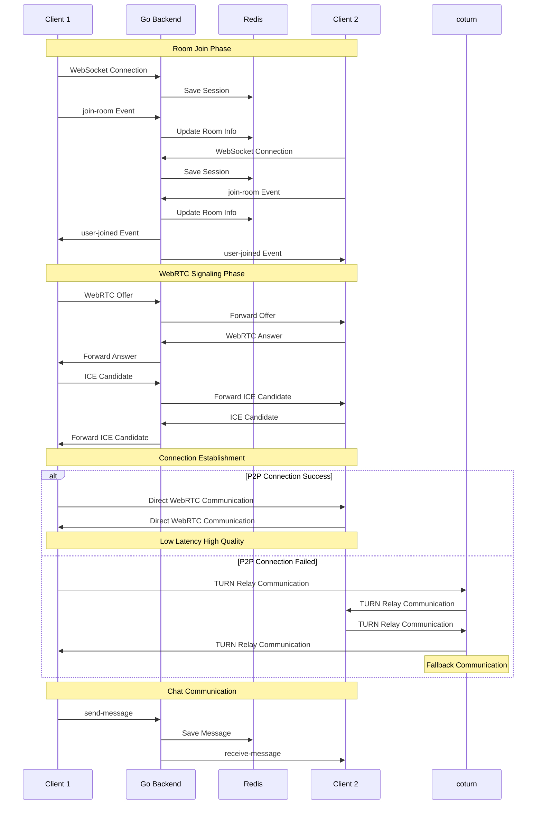

# Cline Meet - Google Meet Clone

クラインと一緒に作る、Google Meetクローンアプリケーション

## プロジェクト概要

WebRTCとWebSocketを活用したビデオ会議アプリケーションのMVP実装。
GKE上でのKubernetes環境での運用を前提とした、フルスタック開発プロジェクトです。

## 機能要件

- **ユーザー認証**: ゲストユーザーのみ（認証機能なし）
- **ビデオ通話**: WebRTCによるカメラ・音声共有
- **チャット機能**: リアルタイムメッセージング
- **基本操作**: ミュート/アンミュート、カメラオン/オフ
- **画面共有**: 実装対象外（MVP範囲外）
- **ホスト権限**: 強制操作機能なし（MVP範囲外）

## 技術スタック

### フロントエンド
- **Framework**: React 19 + TypeScript
- **UI Library**: Tailwind CSS + shadcn/ui
- **WebRTC**: Simple-peer
- **WebSocket**: WebSocket API (native)
- **State Management**: React Context + useReducer
- **Build Tool**: Vite

### バックエンド
- **Runtime**: Go 1.21+
- **Framework**: Gin (HTTP) + Gorilla WebSocket
- **WebRTC Signaling**: Custom implementation
- **Database**: Redis (セッション管理)
- **HTTP Router**: Gin-gonic

### インフラストラクチャ
- **Cloud Provider**: Google Cloud Platform (GCP)
- **Container Orchestration**: Google Kubernetes Engine (GKE)
- **STUN/TURN Server**: coturn (Helm Chart)
- **Load Balancer**: Kubernetes Service (LoadBalancer)
- **DNS**: Cloud DNS
- **SSL/TLS**: Let's Encrypt + cert-manager

### CI/CD
- **CI/CD Platform**: GitHub Actions
- **Container Registry**: Google Container Registry (GCR)
- **Deployment**: Helm Charts
- **Monitoring**: Google Cloud Monitoring


## ディレクトリ構成

```
cline-meet/
├── README.md
├── .gitignore
├── docker-compose.yml              # ローカル開発環境
│
├── frontend/                       # React フロントエンド
│   ├── package.json
│   ├── tsconfig.json
│   ├── vite.config.ts
│   ├── index.html
│   ├── src/
│   │   ├── main.tsx
│   │   ├── App.tsx
│   │   ├── components/
│   │   │   ├── VideoCall/
│   │   │   │   ├── VideoGrid.tsx
│   │   │   │   ├── VideoTile.tsx
│   │   │   │   └── Controls.tsx
│   │   │   ├── Chat/
│   │   │   │   ├── ChatPanel.tsx
│   │   │   │   ├── MessageList.tsx
│   │   │   │   └── MessageInput.tsx
│   │   │   ├── Room/
│   │   │   │   ├── JoinRoom.tsx
│   │   │   │   ├── CreateRoom.tsx
│   │   │   │   └── RoomInfo.tsx
│   │   │   └── Layout/
│   │   │       ├── Header.tsx
│   │   │       └── Sidebar.tsx
│   │   ├── hooks/
│   │   │   ├── useWebRTC.ts
│   │   │   ├── useSocket.ts
│   │   │   └── useMediaDevices.ts
│   │   ├── contexts/
│   │   │   ├── RoomContext.tsx
│   │   │   └── MediaContext.tsx
│   │   ├── types/
│   │   │   ├── room.ts
│   │   │   ├── user.ts
│   │   │   └── message.ts
│   │   └── utils/
│   │       ├── webrtc.ts
│   │       └── socket.ts
│   └── Dockerfile
│
├── backend/                        # Go バックエンド
│   ├── go.mod
│   ├── go.sum
│   ├── main.go
│   ├── cmd/
│   │   └── server/
│   │       └── main.go
│   ├── internal/
│   │   ├── handlers/
│   │   │   ├── room.go
│   │   │   ├── user.go
│   │   │   └── websocket.go
│   │   ├── services/
│   │   │   ├── room.go
│   │   │   ├── signaling.go
│   │   │   └── chat.go
│   │   ├── models/
│   │   │   ├── room.go
│   │   │   ├── user.go
│   │   │   └── message.go
│   │   ├── middleware/
│   │   │   ├── cors.go
│   │   │   └── validation.go
│   │   ├── websocket/
│   │   │   ├── hub.go
│   │   │   ├── client.go
│   │   │   └── signaling.go
│   │   └── config/
│   │       ├── database.go
│   │       └── environment.go
│   ├── pkg/
│   │   ├── redis/
│   │   │   └── client.go
│   │   └── utils/
│   │       └── response.go
│   └── Dockerfile
│
├── kubernetes/                     # Kubernetes マニフェスト
│       ├── helm/                   # Helm Charts
│       │   ├── cline-meet/
│       │   │   ├── Chart.yaml
│       │   │   ├── values.yaml
│       │   │   ├── values-dev.yaml
│       │   │   ├── values-prod.yaml
│       │   │   └── templates/
│       │   │       ├── deployment.yaml
│       │   │       ├── service.yaml
│       │   │       ├── ingress.yaml
│       │   │       ├── configmap.yaml
│       │   │       └── secret.yaml
│       │   └── coturn/
│       │       ├── Chart.yaml
│       │       └── values.yaml
│       └── manifests/              # 生のKubernetesマニフェスト
│           ├── namespace.yaml
│           ├── rbac.yaml
│           └── cert-manager/
│               ├── issuer.yaml
│               └── certificate.yaml
│
├── .github/                        # GitHub Actions
│   └── workflows/
│       ├── ci.yml                  # CI パイプライン
│       ├── cd-dev.yml              # 開発環境デプロイ
│       └── cd-prod.yml             # 本番環境デプロイ
│
├── scripts/                        # 開発・運用スクリプト
│   ├── setup.sh                    # 初期セットアップ
│   ├── build.sh                    # ビルドスクリプト
│   ├── deploy.sh                   # デプロイスクリプト
│   └── cleanup.sh                  # クリーンアップ
│
└── docs/                          # ドキュメント
    ├── architecture.md             # アーキテクチャ設計
    ├── api.md                      # API仕様
    ├── deployment.md               # デプロイ手順
    └── development.md              # 開発環境構築
```

## アーキテクチャ設計

### システム全体構成

```
[Client Browser] 
    ↕ HTTPS/WSS
[GCP Load Balancer]
    ↕
[GKE Cluster]
├── [Frontend Pod] (React App)
├── [Backend Pod] (Node.js + Socket.io)
├── [Redis Pod] (Session Store)
└── [coturn Pod] (STUN/TURN Server)
```

### WebRTC通信フロー



**通信フロー説明:**
1. **ルーム参加**: クライアントがWebSocketでバックエンドに接続
2. **シグナリング**: Offer/Answer/ICE Candidateの交換
3. **P2P接続**: WebRTCによる直接通信確立
4. **フォールバック**: P2P失敗時はTURNサーバー経由

### データフロー

```
[Frontend] ←→ [Backend API] ←→ [Redis]
     ↕              ↕
[WebRTC P2P] ←→ [WebSocket] ←→ [Room Management]
     ↕
[STUN/TURN Server]
```

## 主要コンポーネント設計

### 1. フロントエンド (React + TypeScript)

#### コンポーネント構成
- **VideoGrid**: 参加者のビデオタイル表示
- **Controls**: ミュート/カメラ制御、退出ボタン
- **ChatPanel**: チャット機能
- **JoinRoom**: ルーム参加画面

#### 状態管理
- **RoomContext**: ルーム情報、参加者リスト
- **MediaContext**: カメラ/マイク状態管理

#### WebRTC実装
- **useWebRTC**: WebRTC接続管理フック
- **useSocket**: WebSocket通信フック
- **useMediaDevices**: メディアデバイス制御フック

### 2. バックエンド (Go + Gin + WebSocket)

#### API エンドポイント
```
POST /api/rooms          # ルーム作成
GET  /api/rooms/:id      # ルーム情報取得
POST /api/rooms/:id/join # ルーム参加
```

#### WebSocket イベント
```
// 接続管理
join-room, leave-room, user-joined, user-left

// WebRTCシグナリング  
offer, answer, ice-candidate

// チャット
send-message, receive-message

// メディア制御
toggle-audio, toggle-video, media-state-changed
```

#### サービス層
- **RoomService**: ルーム管理ロジック
- **SignalingService**: WebRTCシグナリング処理
- **ChatService**: チャット機能
- **WebSocketHub**: 接続管理とメッセージ配信

### 3. インフラストラクチャ

#### GKE クラスター構成
- **Node Pool**: e2-standard-4 (開発), e2-standard-8 (本番)
- **Auto Scaling**: 1-10ノード
- **Network Policy**: セキュリティ強化

#### coturn設定
```yaml
# STUN/TURNサーバー設定
realm: cline-meet.example.com
listening-port: 3478
tls-listening-port: 5349
external-ip: <GCP_EXTERNAL_IP>
```

#### Ingress設定
- **SSL終端**: Let's Encrypt証明書
- **WebSocket**: Sticky Session対応
- **Rate Limiting**: DDoS対策

### 4. CI/CD パイプライン

#### GitHub Actions ワークフロー
1. **CI**: テスト実行、Dockerイメージビルド
2. **CD (Dev)**: 開発環境自動デプロイ
3. **CD (Prod)**: 本番環境手動承認デプロイ

#### デプロイ戦略
- **Blue-Green Deployment**: 本番環境
- **Rolling Update**: 開発環境
- **Canary Release**: 段階的リリース

## セキュリティ考慮事項

### ネットワークセキュリティ
- **HTTPS/WSS**: 全通信の暗号化
- **CORS**: 適切なオリジン制限
- **Rate Limiting**: API呼び出し制限

### Kubernetes セキュリティ
- **Network Policies**: Pod間通信制限
- **RBAC**: 最小権限の原則
- **Secret Management**: 機密情報の適切な管理

### WebRTC セキュリティ
- **DTLS**: メディア通信の暗号化
- **TURN認証**: 認証付きTURNサーバー

## 監視・ログ

### メトリクス監視
- **GCP Monitoring**: インフラメトリクス
- **Application Metrics**: レスポンス時間、エラー率
- **WebRTC Metrics**: 接続品質、帯域使用量

### ログ管理
- **Structured Logging**: JSON形式
- **Log Aggregation**: GCP Cloud Logging
- **Error Tracking**: エラー監視・アラート

## 開発環境

### ローカル開発
```bash
# 依存関係インストール
npm install

# 開発サーバー起動
docker-compose up -d

# フロントエンド開発サーバー
cd frontend && npm run dev

# バックエンド開発サーバー
cd backend && npm run dev
```

### 環境変数
```env
# Backend
NODE_ENV=development
PORT=3001
REDIS_URL=redis://localhost:6379
TURN_SERVER_URL=turn:localhost:3478
TURN_USERNAME=user
TURN_PASSWORD=pass

# Frontend  
VITE_API_URL=http://localhost:3001
VITE_WS_URL=ws://localhost:3001
```

## 今後の拡張予定

### Phase 2 機能
- **ユーザー認証**: Google OAuth2.0
- **画面共有**: Screen Capture API
- **録画機能**: MediaRecorder API

### Phase 3 機能  
- **ホスト権限**: 参加者管理機能
- **ブレイクアウトルーム**: 小グループ分割
- **ファイル共有**: ドラッグ&ドロップ

### スケーラビリティ
- **SFU実装**: 大規模会議対応
- **CDN**: 静的コンテンツ配信
- **Multi-Region**: 地理的分散

## ライセンス

MIT License

## 貢献

プルリクエストやイシューの報告を歓迎します。
開発ガイドラインについては `docs/development.md` を参照してください。
